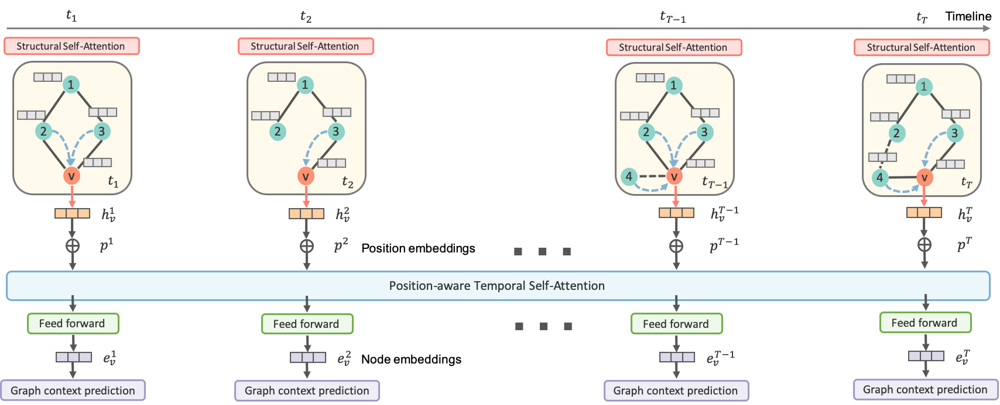

# Dynamic Graph Representation Learning via Self-Attention Networks.

### Contributors: [Aravind Sankar](http://asankar3.web.engr.illinois.edu/) (asankar3@illinois.edu), Yanhong Wu, Liang Gou, Wei Zhang and Hao Yang.


This directory contains a TensorFlow implementation of DySAT - Dynamic Self Attention (DySAT) networks for 
dynamic graph representation Learning. DySAT is an unsupervised graph embedding 
model to learn node embeddings in dynamic time-evolving attributed graphs, which may later be used for downstream 
application tasks such as link prediction, clustering and node classification.

Note: Though DySAT is designed for attributed dynamic graphs, our benchmarking experiments are carried 
out on datasets that do not have node attributes.
 




To support streaming graph applications, we also provide an implementation of Incremental 
Self-Attention (IncSAT) Networks to learn dynamic incremental node embeddings in a stage-wise fashion. 
See our [paper](https://arxiv.org/pdf/1812.09430.pdf) for details on the algorithm.


A preliminary version of this work has been published in the workshop: <i>Representation Learning on 
Graphs and Manifolds, ICLR 2019</i>.

If you make use of this code or the DySAT algorithm in your work, please cite the following paper:

```angular2
@article{sankar2018dynamic,
  title={Dynamic Graph Representation Learning via Self-Attention Networks},
  author={Sankar, Aravind and Wu, Yanhong and Gou, Liang and Zhang, Wei and Yang, Hao},
  journal={arXiv preprint arXiv:1812.09430},
  year={2018}
}

```


### Requirements:

Recent versions of TensorFlow (<= 1.14), numpy, scipy, sklearn, and networkx (<= 1.11) are required.
The code has been tested under Python 2.7. The required packages can be installed using the following
command:

``$ pip install -r requirements.txt``

To guarantee that you have the right package versions, you can use Anaconda to set up a virtual environment and install the dependencies from ``requirements.txt``.


### Input format

In order to use your own data, you have to provide:

- ``graphs``: list of networkx graphs (or multigraphs) for each time step, saved as `.npz` files. Have a look at the ``load_graphs()`` and ``load_feats()``  functions in ``utils/preprocess.py`` for an example.

- ``features``: list of ``N x D`` feature matrices (``N`` is the number of nodes and ``D`` is the number of features per node) in scipy sparse format) -- optional.

### Repository organization
- ``data/`` contains the necessary input file(s) for each dataset after pre-processing.
- ``raw_data/`` contains data pre-processing jupyter notebooks for reference.
- ``models/`` contains the implementation of two models - ``DySAT`` and ``IncSAT``.
- ``utils/`` contains:
    - preprocessing subroutines (``preprocess.py``, ``utilities.py``, ``random_walk.py``);
    - minibatch iterators (``minibatch.py``, ``incremental_minibatch.py``);
- ``eval/`` contains evaluation scripts that use simple logistic regression classifiers for link prediction based on the learnt node embeddings.

The pre-processed versions of all datasets are available [here](https://drive.google.com/open?id=1TAWipN2y6uYf5BRtlKp-NY2BT3znH1YB).

### Running the code
The code can be run by executing ``python run_script.py``. The default values of all parameters are set in the script file and can be specified as command line arguments. The most important arguments are ``min_time`` and ``max_time`` that specify the range of time steps to train the model.
This script calls multiple instances of ``train.py`` (or ``train_incremental.py``) with time steps in this range (both
 ends 
included).

For example, if ``min_time`` is 2 and ``max_time`` is 3, two instances of the model are trained, where the first one trains on the G<sub>1</sub>, while the second instance trains on G<sub>1</sub> and G<sub>2</sub>. In case of link prediction, the evaluation is performed on the links in G<sub>2</sub> for the first instance, and the links of G<sub>3</sub> for the second.

The other hyper-parameters of the model are specified in ``run_script.py`` (along with detailed descriptions) and may need to be appropriately tuned for different datasets.

### Logging directory

For logging, the ``model`` flag should be provided to specify the variant/version of the experimented model 
(initially set to ``default``), in addition to choosing ``base_model`` as DySAT or IncSAT.

A logging directory ``log_dir`` is then created at ``./logs/<base_model>_<model>/``, overwriting any existing files that might conflict.

The output of the model, log files and evaluation results (on link prediction) will be stored in subdirectories of ``log_dir``, with date-wise logged files, along with the set of hyper-parameters and settings used in the experiment.

The learnt embeddings will be stored in numpy formatted files at subdirectory ``output/`` and the results of downstream evaluation tasks will be stored in a subdirectory ``csv/``, within ``log_dir``.
